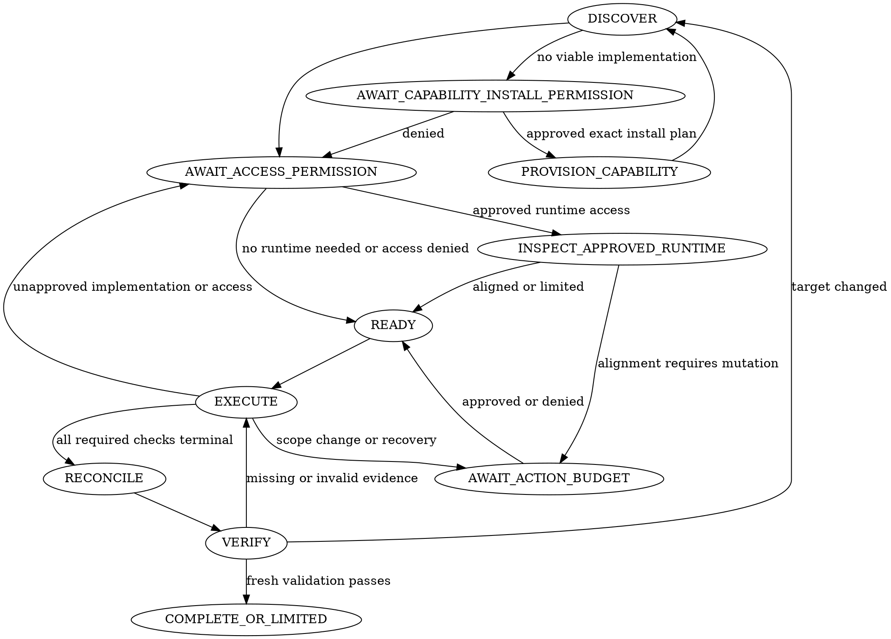

# PR QA review

## Review contract

Remain the root orchestrator. Review the requested change; do not fix product code. Treat the skill invocation as
permission to perform passive discovery and write review artifacts only. It does not authorize executing tests,
browsers, scanners, or deployment tools, contacting a runtime, or mutating an environment.

Store durable state in the artifact directory described by
[review state](references/review-state-schema.md). Update it immediately after every user decision, check, artifact,
mutation, cleanup action, candidate decision, and target recheck. Resume from this state after compaction or restart.

## The iron laws

```text
NO EVIDENCE CHECK, RUNTIME ACCESS, OR MUTATION WITHOUT RECORDED PERMISSION FOR THE SELECTED IMPLEMENTATION, TARGET,
ACCESS MODE, AND ACTION.

NO COMPLETE REVIEW WHILE REQUIRED EVIDENCE IS OPEN OR THE REVIEW PACKAGE FAILS FRESH VALIDATION.
```

Passive discovery never authorizes execution. A failed check never authorizes recovery work. A new implementation,
target, access mode, side effect, cleanup operation, fallback, or recovery action returns the workflow to the
applicable permission gate.

## State machine



Do not skip a state or move forward on intent. Each transition requires the recorded evidence or user decision below.

## State 1: DISCOVER

Record the target kind, repository, requested scope, report path, artifact directory, user focus, and paths to previous
review material. Resolve complete local `base_oid` and `head_oid` values. During discovery, classify the target from
name-status and diff statistics. Remote metadata and file summaries support discovery but never replace the exact local
diff during approved static review.

Resolve the bundled initializer path and create a new artifact package before deeper analysis:

```bash
python3 <skill-directory>/scripts/init-review-package.py <artifact-directory> \
  --base-oid <complete-base-oid> --head-oid <complete-head-oid>
```

If the directory already exists, inspect and resume it; do not overwrite the report or ledger.

Read [change analysis](references/change-analysis.md). Add a coverage row and required evidence slots for every changed
domain, public or persisted contract, focus area, and user-reachable surface. Do not remove required coverage because
an implementation, runtime, credential, or agent is unavailable.

Perform passive capability discovery only:

- inspect repository instructions, scripts, dependencies, and documented workflows;
- inventory harness and MCP capability metadata;
- check executable presence without running the executable as a review check;
- identify configured local environment and cluster names without contacting workloads; and
- identify named package agents, generic agents, and main-thread ownership.

Record one `capability_discovery` entry for each capability discovery source: repository-native workflows, harness or
MCP tools, local executables, and configured local runtimes. Use `inspected` or `unavailable` with concise non-secret
evidence. For each required capability, record every visible viable implementation from these sources, then select a
preferred implementation and reasonable fallbacks. Do not substitute one familiar product for source inventory.

State 1 MUST inventory each relevant local runtime class exposed by the repository or machine configuration. This
includes Docker contexts, kube-contexts, and kind, minikube, or k3d names when their configuration or executable is
present. Read only local configuration; do not contact a daemon, API server, cluster, or workload. Do not stop after
finding the first runtime candidate. Record every relevant discovered local development environment with unresolved
read-only access permission.

Never render a credential-bearing configuration file during discovery. Extract only names and non-secret metadata
with field-selective parsing. Do not print whole kubeconfigs, Docker authentication files, browser profiles, environment
files, tokens, certificates, keys, or credential fields to the transcript or artifacts.

Do not invoke a runtime CLI during passive discovery when it may contact a daemon, cluster, service, or workload.
Extract configured names from local metadata instead. A command advertised as `list`, `context`, or `get` is not
automatically offline.

For every candidate implementation, record its capability, execution surface, owner binding, owner-boundary mode,
target, access mode, expected side effects, fallback order, and permission as `unresolved`. Tool presence is not
permission and is not proof that the selected owner can invoke it.

STOP passive discovery as soon as the required coverage rows, one repository-native implementation, reasonable
fallbacks, configured environment names, owner bindings, and permission candidates are recorded. Do not perform defect
analysis, read complete previous reports, or inspect implementation bodies beyond what classification and capability
routing require. Static review is an evidence check and starts only after the user approves its implementation and
target. Deeper reading before the first gate violates the state machine.

State 1 MUST NOT read patch hunks or broad file bodies. It may read repository instructions and the smallest manifest,
script, or configuration slice needed to identify a capability, target name, or side effect. Reading the exact patch,
requirements, contracts, previous findings, and implementation bodies belongs to the approved static-review check.

Set `workflow_state` to the next permission state and validate the discovery ledger:

```bash
python3 <skill-directory>/scripts/validate-review-package.py --gate discovery <artifact-directory>
```

State 1 MUST NOT ask the first permission question until this command exits zero. A failure means the ledger is missing
coverage, evidence slots, candidate permissions, concrete implementations, or owner bindings; repair the ledger and
rerun the gate without expanding discovery.

**Transition gate:** `review-state.json` contains the exact target, required coverage and evidence slots, candidate
implementations, candidate environments, ownership bindings, and artifact paths. No evidence-producing check or
runtime request has run. A capability with no viable candidate enters `AWAIT_CAPABILITY_INSTALL_PERMISSION`; all other
required capabilities enter `AWAIT_ACCESS_PERMISSION`.

## State 2: AWAIT_ACCESS_PERMISSION

Present the discovered tools and environments in one bounded question. Ask separately for each material group of
actions, but allow one reply to approve or deny several groups. Group requests by required capability. In the question,
name every concrete selected implementation and approved fallback, target, access mode, expected local write or service
effect, evidence slot unlocked, and coverage impact of refusal. A capability name such as `browser interaction` does
not authorize every implementation that can provide it.

The first review-access permission question MUST NOT include a deployment, recovery, rollback, cleanup, or other
runtime mutation budget. It may request repository checks and read-only inventory of discovered runtimes. Runtime
inventory must finish before the agent chooses or proposes in-place, new-namespace, Compose, or new-cluster execution.
A future action budget is not valid merely because the user approved read-only inventory.

Always ask before:

- executing repository-native build, test, E2E, browser, scanner, or deployment commands;
- invoking a browser or UI adapter against the application;
- contacting a local or remote API, cluster, namespace, log source, metric source, or runtime; or
- installing or enabling a dependency, tool, browser, adapter, or service.

Record every decision as `approved` or `denied`, with `decision_source: user` and concise evidence of the reply. Do not
convert silence into denial or downgrade unresolved evidence to a limitation. When the answer is unavailable, save a
preliminary report and stop in `BLOCKED`.

**Transition gate:** Every implementation selected for immediate repository checks or read-only runtime inventory has
recorded permission for its implementation, target, access mode, and allowed actions. The first gate contains no
runtime mutation budget. Denied capabilities retain their evidence slots and impact.

### Capability provisioning substate

When a required capability has no viable available implementation, read
[runtime and environment](references/runtime-and-environment.md) and propose the optional installation plan defined
there. Enter `AWAIT_CAPABILITY_INSTALL_PERMISSION`; do not combine this request with permission to execute the installed
implementation.

On explicit approval, enter `PROVISION_CAPABILITY`, perform only the approved installation actions, record their
effects and cleanup path, and return to `DISCOVER`. Rediscover the implementation and owner binding before requesting
permission to execute it. On denial, retain the evidence slot and continue to the access gate with the coverage impact.

## State 3: INSPECT_APPROVED_RUNTIME

Read [runtime and environment](references/runtime-and-environment.md). Inspect only approved environments and prove
whether every changed deployed layer matches the complete `head_oid`. Record application artifacts, effective
configuration, deployment descriptors, migrations, generated assets, and relevant external contracts.

Only after the approved inventory is recorded, present the existing local developer runtime first, including releases,
namespaces, workloads, data-bearing resources, routes, reachable URLs, and alignment proof. Prefer an in-place check of
the existing local developer runtime first when it provides relevant upgrade or persisted-data evidence. Explain why a
new namespace, Compose project, or new cluster is preferable before proposing it.

If alignment needs a mutation, prepare a separate exact action budget before acting. Name the environment, commands or
action types, resources, state effects, indirect work, rollback, cleanup, evidence unlocked, and explicitly excluded
actions. Ask the user to approve or deny this budget. Ask for browser permission here when inventory resolves the exact
runtime URL; name each browser implementation and fallback separately.

An approved deployment or update does not authorize unplanned rollback, resource-limit changes, Secret deletion, PVC
replacement, persistent-data changes, recovery upgrades, cleanup, or any other action absent from the budget. Stop and
ask again when execution needs one of them.

**Transition gate:** Each runtime-dependent row is aligned with recorded proof, ready under an approved action budget,
or limited by an explicit denial or demonstrated unavailability. No unresolved runtime decision remains.

## State 4: READY

Assign each check to the first owner that can invoke its approved implementation: matching package specialist, generic
agent, or main thread. Runtime-dependent checks also require verified runtime URLs and alignment proof. Do not delegate
a browser implementation merely because it is available to the root; prove it is callable in the leaf context.

Treat a declared leaf tool allowlist as an enforceable boundary only when the active harness preserves and enforces the
leaf tool boundary in the spawned context. When a leaf has an inherited or unrestricted tool surface, keep the check in
the main thread if it requires shell, network, browser, scanner, runtime, deployment, or mutation capabilities. Such a
leaf may own bounded static reasoning under approved source access, but its instructions are not proof of tool
isolation. Record `owner_boundary` and `execution_surface` as defined by
[review state](references/review-state-schema.md).

Each delegated packet contains exact revisions; one bounded track and file set; relevant requirements; check IDs and
evidence slots; approved implementations and targets; runtime proof; permission and action budgets; artifact paths;
and the response contract. Leaf agents do not delegate, rediscover the full target, exceed a budget, or write the final
report.

**Transition gate:** Every executable check has an owner that can invoke its implementation. Every other required
check is recorded as denied or unavailable with impact, not silently omitted.

## State 5: EXECUTE

Run only approved checks. For each check, set `running`, execute it, then immediately record the command or action,
target, implementation, time, exit or outcome, artifacts, negative result, limitation, and actual side effects. Copy
ephemeral outputs into the artifact directory before continuing. A path under `/tmp` is not a retained artifact.

Use only approved fallbacks. Return to `AWAIT_ACCESS_PERMISSION` before invoking an unapproved fallback or target.
Return to `AWAIT_ACTION_BUDGET` before an unplanned mutation, recovery action, rollback, or cleanup.

Use these check statuses:

- `planned` or `running`: open and non-terminal;
- `satisfied`: executed with required retained evidence;
- `denied`: the user denied the necessary permission, with impact;
- `unavailable`: approved execution was attempted but no implementation succeeded, with evidence and impact; and
- `not_applicable`: an observable trigger is absent, with the reason recorded.

Do not use `skipped`. Derive each coverage row from its required checks: all `satisfied` or justified
`not_applicable` means `complete`; any `denied` or `unavailable` means `limited`; any open check means `blocked`.

**Transition gate:** Every required check is terminal and all satisfied checks have retained artifacts.

## State 6: RECONCILE

Read [report quality](references/report-quality.md). Challenge each candidate against requirements, contracts, base
behavior, tests, ADRs, documented limitations, accepted risks, and contradictory evidence. Merge duplicates and split
independently fixable claims. Reconcile previous findings and useful rejected candidates.

Classify retained candidates as `Confirmed`, `Strong static evidence`, or `Suspected`. Only the first two enter main
findings. Keep review questions separate from findings and retain only questions with concrete anchors and a material
unresolved requirement, correctness, compatibility, or maintenance concern.

**Transition gate:** Every candidate and previous finding has an evidence-backed decision. Finding counts exclude
suspected candidates and review questions.

## State 7: VERIFY

Re-resolve the complete target head. If it changed, record the new OID, compute the exact delta, reopen affected
coverage and checks, and return to `DISCOVER`. If the delta cannot be reviewed, set the report to `STALE` and stop.

Write the report from durable state using [the report template](references/report-template.md). Resolve the bundled
validator path and run:

```bash
python3 <skill-directory>/scripts/validate-review-package.py <artifact-directory>
```

Read the full output and exit code. A failed validation returns to `EXECUTE` or the state named by the error. Do not
replace a missing artifact with prose or claim completion from an earlier validator run.

**Transition gate:** Fresh validation exits zero against the final artifact directory and rechecked target.

## Terminal states

- `COMPLETE`: every required coverage row is complete and fresh validation passes.
- `LIMITED`: every gap is denied, unavailable, or not applicable with impact, and fresh validation passes.
- `BLOCKED`: a material permission or decision remains unresolved. Save a preliminary report and ask one question.
- `STALE`: the target changed and the delta was not reviewed. Preserve both complete head OIDs.

Only `COMPLETE` and `LIMITED` are finished reviews. The final response states the terminal state; finding counts;
report and artifact paths; approved checks run; meaningful negative results; limitations and impact; actions, side
effects, and cleanup; validator result; and final target recheck.

## Reference routing

During `DISCOVER`, read only [change analysis](references/change-analysis.md) and
[review state](references/review-state-schema.md). Do not load domain references merely because their track triggered.

After the applicable permission gate:

- read [runtime and environment](references/runtime-and-environment.md) before approved runtime inspection or an action
  budget;
- read [UI and user surfaces](references/ui-and-user-surfaces.md) before approved UI checks;
- read [API and compatibility](references/api-and-compatibility.md) before approved backend or contract checks;
- read [data lifecycle](references/data-lifecycle.md) before approved lifecycle checks;
- read [deployment and configuration](references/deployment-and-configuration.md) before approved deployment checks;
  and
- read [security](references/security.md) before approved security checks.

Read [report quality](references/report-quality.md) before reconciliation and final validation.

## Red flags: stop and return to the gate

- "It is local, so read-only access is safe without asking."
- "The user approved the deployment, so recovery changes are implied."
- "The preferred browser failed, so another installed browser is automatically allowed."
- "The leaf can probably use the same MCP tool as the root."
- "The screenshot exists in `/tmp`, so the report can link it later."
- "Mark the track limited and finish."
- "The report looks complete; validation is unnecessary."

Each statement means the workflow is at the wrong state. Stop and return to the applicable permission, execution, or
verification gate.
