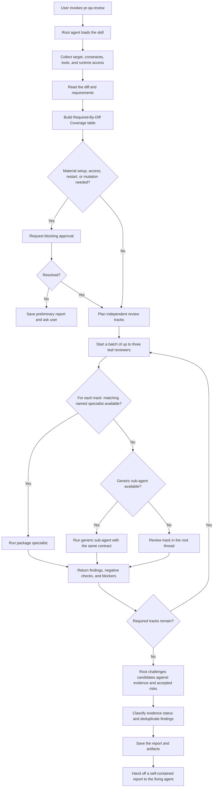

# pr-qa-review

An orchestrated QA review workflow for pull requests and code changes. The package helps an agent inspect the diff,
requirements, design documents, runtime behavior, UI, APIs, logs, deployment manifests, and documentation, then save an
evidence-backed defect report.

The skill is intentionally user-invoked. Use it when you want a broad QA-style review rather than a narrow code review.
It does not modify product code unless the user explicitly asks for fixes.

## Package organization

Invoke the `pr-qa-review` skill as the single entry point. The package also ships specialist agents for bounded review
tracks. These agents are optional: the skill uses a matching named agent when the harness exposes it, falls back to a
generic sub-agent when available, and otherwise reviews the track in the main thread. The workflow never creates agent
definition files at runtime. Specialists are leaf agents and never orchestrate or delegate further work.

The specialists declare a tool whitelist that excludes direct file-editing tools. This reduces accidental writes where
the harness honors tool metadata, but it is not a replacement for the harness sandbox: shell commands can still change
state. The skill therefore keeps delegated tasks explicitly read-only and inherits stronger sandbox and permission
boundaries from the root agent when the harness provides them.

The package does not include an always-on instruction or a separate prompt. Installing it does not affect unrelated
conversations; the workflow starts when the user invokes the skill.

## Workflow



The root agent owns planning, user questions, permission decisions, evidence validation, and the final report. Batching
limits resource use without dropping coverage: additional required tracks run in later batches. A failed or unavailable
sub-agent changes the execution mode, not the required coverage.

Setup permission that materially affects a required track is a blocking checkpoint. A progress update does not count as
approval. The root uses a harness approval mechanism when available; otherwise, it saves a preliminary report and ends
the turn with the question instead of finalizing weakened coverage.

The same checkpoint applies when an important scenario requires restarting services or mutating Docker Compose, Kind,
a deployment, test data, object storage, or cluster state. The request identifies the target, expected impact, cleanup,
and evidence unlocked. Approved actions and their side effects are recorded; declined actions leave the affected track
partial rather than being represented as runtime-tested.

Every confirmed finding records whether its evidence is runtime, browser, test, static, or mixed. Before confirmation,
the root checks nearby design decisions, tests, explicit deferrals, and accepted risks. Useful rejected candidates stay
in a separate section and do not inflate the confirmed count.

## What it produces

A Markdown report under a user-selected path, usually `reports/<topic>.md`, with screenshots, logs, command output, and
links to relevant code. Each finding includes severity, classification, reproduction steps, actual and expected results,
evidence, affected scope, a supported fix direction, and retest criteria. The report is designed as a self-contained
handoff to an agent that will fix the confirmed defects.

## Install

```sh
apm install Netcracker/qubership-ai-packages/agent-packages/pr-qa-review
```

Or add it to your `apm.yml`:

```yaml
dependencies:
  apm:
    - Netcracker/qubership-ai-packages/agent-packages/pr-qa-review@v1.0.0
```

Then run `apm install` and `apm compile`.

## Usage

Ask the agent to use `pr-qa-review` and provide the target PR, branch, commit, or local change set.
This is an example request, not a required template:

```text
Use pr-qa-review to review PR #123:
https://github.com/example/project/pull/123

Save the report to reports/pr-123-qa-review.md.
Use parallel sub-agents for independent tracks when available, with pr-qa-review remaining the root orchestrator.

Focus on backend/API, UI, deployment, runtime logs, and security.
Do not modify source code, deployment state, or test data; only investigate and report bugs.
Do not run disruptive read-only checks, such as huge-range, malformed, cleanup, TTL, compaction,
or stress requests, unless you ask first or use an isolated disposable environment.
```

You can omit the focus line when you want the agent to infer all required tracks from the diff:

```text
Use pr-qa-review to review PR #123:
https://github.com/example/project/pull/123

Save the report to reports/pr-123-qa-review.md.
Use parallel sub-agents for independent tracks when available, with pr-qa-review remaining the root orchestrator.
Do not modify source code, deployment state, or test data; only investigate and report bugs.
```

Optional runtime setup block, when a local stand exists and may need updating before the review:

```text
A local stand is available. You may update it to the PR version before the review.
After setup/update, switch to read-only mode and do not change source code, deployment state, cluster state,
or test data again.
```

Optional previous-run comparison block, when you want the report to reconcile prior findings. The agent should also
reconcile prior findings when they are already known from the current review context:

```text
Compare with the previous report:
reports/pr-123-qa-review-previous.md

For each previous finding, mark it as reproduced, not reproduced, superseded, accepted/out of scope,
or not rechecked with a reason.
```

The workflow can use local runs, a local cluster, browser automation, API calls, logs, metrics, Helm rendering,
and static analysis when available. After reading the diff, it should create a Required-By-Diff Coverage table for
tracks such as design, protocol compatibility, data lifecycle/retention, UI, deployment, and security, including the
owner for each track. User focus areas prioritize the review but do not remove required-by-diff tracks. If an important
tool is missing for a requested focus area, the agent should explain the value of installing or enabling it and ask
before relying on a weaker fallback.
